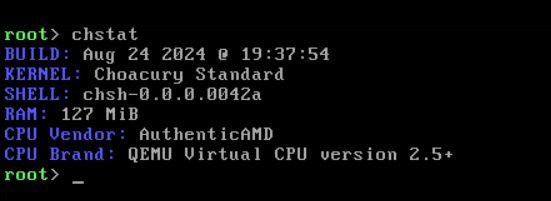

# `chstat` command
The chstat command shows general information about the current device and kernel, included information is:

- Build date
- Kernel name
- Shell version
- Amount of RAM
- CPU Vendor & Brand

## Examples (Screenshots)
This is what the base `chstat` command looks like:

