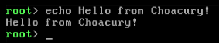

# `echo` command
This command will write out what you tell it to.

## Argument information
After `echo`, simply type the text out and press return to have it echoed to you.

## Examples (Screenshots)
This is what the base `echo` command looks like:

