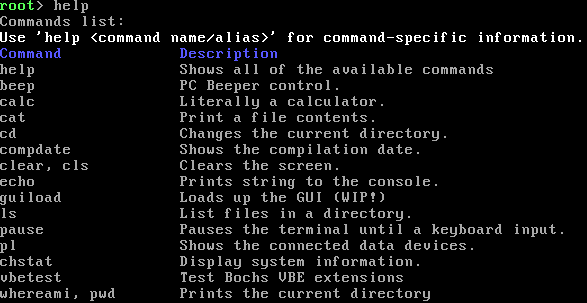
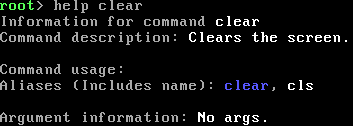
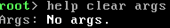

# `help` command
The help command can give you information about any command registered within the shell (May not contain all).
It includes usage information.

## Argument information
Here is what the different parts of the arguments means.

### Wrapped in `<>` or `()`
When an argument is wrapped in `<>` or `()` it means that is is an optional.

### Wrapped in `[]`
When an argument is wrapped in `[]` it means that it is **required**.

### Starts with `int`
This means that the argument must be an integer (Whole number).

### Starts with `str`
This means that the argument must be a string.

## Examples (Screenshots)
This is what the base `help` command looks like:

And this is what parsing the `<command name/alias>` argument looks like:

And then also parsing the `(args)` argument looks like this:

